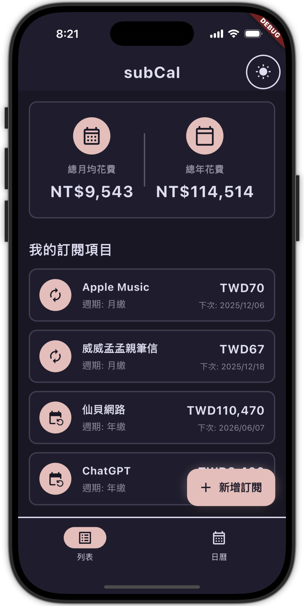

# subCal

#### 不會再忘記訂閱了什麼奇怪的服務

---

> 我的第一個 APP 嘻嘻，謝謝 Calude code 的協助
>
> 這是為雲科大人通識課「APP 程式開發」做的期中報告，但希望之後可以更完善
>
> 第一次寫 flutter 所以有點醜 ><

- [介紹簡報](public/subCal.pdf)
- [Demo 影片](https://drive.google.com/file/d/1V86nq_mCkqEuuuUeIPJRNmZmgplfFJCh/view?usp=sharing)

