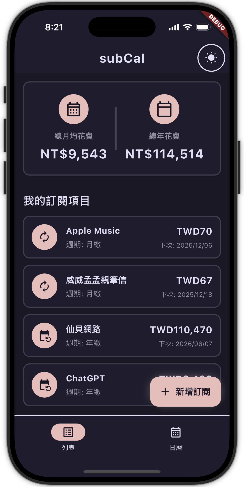

<div align='center'>

# subCal

#### 不會再忘記訂閱了什麼奇怪的服務



</div>

---

> 我的第一個 APP 嘻嘻，謝謝 Calude code 的協助
>
> 這是為雲科大通識課「APP 程式開發」做的期中報告，但希望之後可以更完善
>
> 第一次寫 flutter 所以有點醜 ><

- [期中介紹簡報](public/subCal_midterm.pdf)
- [期末介紹簡報](public/subCal_final.pdf)
- [Demo 影片](https://drive.google.com/file/d/1V86nq_mCkqEuuuUeIPJRNmZmgplfFJCh/view?usp=sharing)

## 專案結構

專案已經重構為模組化架構，方便維護和擴展：

```
lib/
├── main.dart                          # 應用程式進入點與主題設定
├── models/                            # 資料模型
│   ├── billing_cycle.dart            # 付款週期定義
│   ├── category_model.dart           # 分類模型
│   ├── subscription.dart             # 訂閱模型
│   └── models.dart                   # 統一匯出
├── services/                          # 服務層
│   ├── notification_service.dart     # 通知服務
│   └── services.dart                 # 統一匯出
├── providers/                         # 狀態管理
│   ├── theme_provider.dart           # 主題管理
│   └── providers.dart                # 統一匯出
├── screens/                           # 畫面
│   ├── subscription_home_page.dart   # 首頁（訂閱列表）
│   ├── calendar_view.dart            # 日曆檢視
│   ├── category_management_screen.dart # 分類管理
│   ├── subscription_form_screen.dart  # 新增/編輯訂閱表單
│   └── screens.dart                  # 統一匯出
└── widgets/                           # 可重用元件
    ├── total_summary_card.dart       # 總支出卡片
    ├── subscription_list.dart        # 訂閱清單
    └── widgets.dart                  # 統一匯出
```

### 模組說明

- **models/**: 包含所有資料模型和業務邏輯
- **services/**: 處理外部服務（如通知）
- **providers/**: 管理應用程式狀態
- **screens/**: 完整的頁面元件
- **widgets/**: 可重用的 UI 元件

每個資料夾都有對應的匯出檔案（如 `models.dart`、`services.dart`），方便統一導入。
